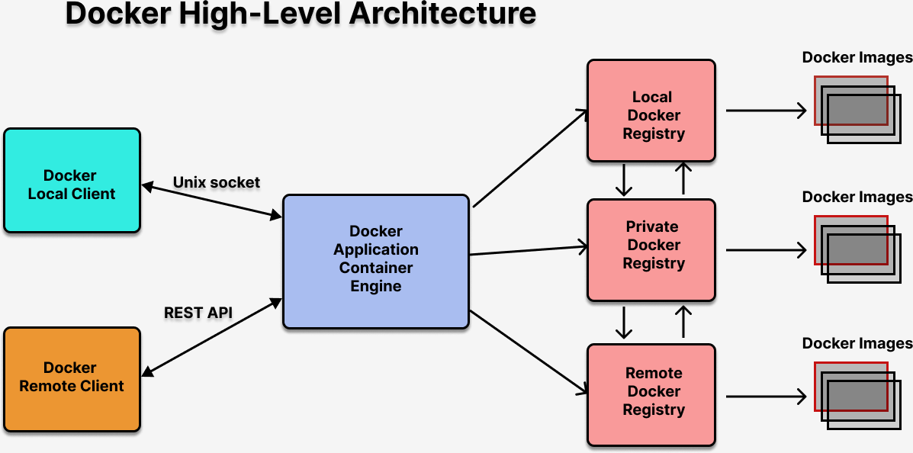

# Day 1

## What is Hypervisor?
- aka Virtualization
- Hardware + Software Technology
  General Purpose Processors
  1. AMD - virtualization feature is AMD-V
  2. Intel - Virtualization feature is VT-X
- two types
  1. Type 1 - Meant for Servers/Workstations ( Type 1 hypervisor is directly installed on the Hardware - no OS is required)
  2. Type 2 - Meant for Laptops/Desktops/Workstations( Type2 hypervisor is installed on top of Host OS )
- Examples
  1. Oracle VirtualBox (Free)
  2. VMWare ( Commercial - need license )
     - Fusion ( Type 2 - Mac OS-X)
     - Workstation ( Type 2 - Windows & Linux ) 
     - vSphere/Vcenter ( Type 1 )
  3. KVM - Kernel Virtual Manager (Opensource)   
  4. Parallels ( Type 2 - Mac OS-X )   
- allows running many Operating System within Virtual Machine side-side i.e many OS can be active on the same system
- each Virtual Machine is allocated with dedicated hardware resources
  - CPU
  - RAM
  - Storage
- hence, this type of virtualization is called as Heavy weight virtualization
- The OS installed with VM/Guest OS is a fully functional Operating Sytem

## What is Application Virtualization?
- Container technology
- each container represents one single application
- each container, runs in its namespace
- every container has its own dedicated Network Stack and Virtual Network Card, hence an IP is allocated for each container
- every container get a file system 
- When Docker for Windows is installed it installs a thin-linux layer which has the Linux Kernel
- When Docker for Mac is installed, it installs a thin-linux layer which has the Linux Kernel
- in Linux Host OS, we can only run Linux containerized application as we have only Linux Kernel
- in Windows Host OS, we can run both Windows containerized applications as well Linux containerized applications
 
## Docker Overview
- developed by Docker Inc organization in Go Programming language
- it comes in two flavours
  - Docker Community Edition(CE) - you get opensource Docker Images with limited officially certied Docker images
  - Docker Enterprise Edition(EE) - you get officially certified Docker Images, you get support from Docker Inc
- follows client/server architecture
  Client - docker utility
  Server - dockerd or Daemon which runs as a Daemon service

## What is a Docker Image?
- specification of a Docker Container
- the software tools required on a container can be installed on the Docker Image
- Using Docker Image, we can create any number of Containers

## What is a Docker Container?
- an instance of Docker Image
- each running container, get atleast one IP address as container may have more than one Network Interface Cards (NIC)

## What is a Docker Container Registry?
- this is where Docker Images are hosted
- three types of Docker Registry
  - Local Docker Registry ( /var/lib/docker folder on your system where Docker is installed )
  - Remote Docker Registry - Docker Hub (Web portal) that has many opensource Docker Images
  - Private Docker Registry - Optional ( can be setup using Sonatype Nexus, JFrog Artifactory, for learning or R&D purpose you could also use the registry:2 Docker Image from Docker Hub

## What is Container Runtime?
- this is the software utility that manages the containers
  - creating container
  - start/stop/restart/abort/kill/delete containers
  - are normally used only by Container Engine
 - Example
   - runC - used by Docker Container Engine
   - CRI-O - used by Podman Container Engine

## What is Container Engine?
- this a high-level software used by end-users like us
- Container Engines dependes on Container Runtimes to manage containers
- Container Engines also depends on other tools to manage Container Images
- Container Engines provide easy-to-use user-friendly commands 
- Without knowing lowel-level container internals, we can manage container images/containers using this tool
- Example
  - Docker
  - Podman

## Hypervisor High Level Architecture


## Docker High Level Architecture


## Docker Image Layers and Containers


## What is a Container Orchestration Platform?
Examples
1. Docker SWARM
2. Google Kubernetes
3. Red Hat OpenShift

### Common Features supported by any Container Orchestration Platform
1. Manages containerized application taking help of Container Engines/Runtimes
2. In built monitoring features 
   - checks the health of each containerized applications and repairs then if they are found unhealthy
   - check if the containerized application is live, ie is it responding to user request if not it will be replaced with another healthy live instance of the same containerized application
3. High Availability (HA)
   - it ensures, the desired number of application instances are always running
   - whenever the Orchestration plaform finds either less number of instances running or more than the desired number of application instances are running, it ensure the desired instances matches with the actual number of instances
4. Supports Service abstraction
   - Service represents a group of load-balanced application instances of same type
   - End-user application that needs let's say mysql db server, they will access the mysql db instance via Service
   - each service has a name and IP address
6. Supports Service Discovery
   - nothing but accessing the Service by its name
   - Orchestration Platforms support DNS - Domain Naming Server 
     - translates the name of the service to its corresponding IP address
7. Scale up/down 
   - Whenever the traffic to your web applications/microservices increase, you may scale up the number of application instance to handle the user traffic with less response time
   - Whenever the traffic to your web applications/microservices decrease, you may scale down the number of application instances
8. Rolling update
   - assume you have alreay deployed some microservice whose version is 1.0, if you wish to deploy v2.0 without any down time, you can use the rolling update feature of the Orchestration Platform
   - support rollback
 

# Docker Commands

## Finding the docker version
```
docker --version
```

## Listing the Docker images
```
docker images
```

## Finding more detailed information about your docker installation
```
docker info
```

Expected output
<pre>
(jegan@tektutor.org)$ docker info
Client:
 Context:    default
 Debug Mode: false

Server:
 Containers: 6
  Running: 4
  Paused: 0
  Stopped: 2
 Images: 116
 Server Version: 20.10.7
 Storage Driver: overlay2
  Backing Filesystem: extfs
  Supports d_type: true
  Native Overlay Diff: true
  userxattr: false
 Logging Driver: json-file
 Cgroup Driver: cgroupfs
 Cgroup Version: 1
 Plugins:
  Volume: local
  Network: bridge host ipvlan macvlan null overlay
  Log: awslogs fluentd gcplogs gelf journald json-file local logentries splunk syslog
 Swarm: inactive
 Runtimes: io.containerd.runc.v2 io.containerd.runtime.v1.linux runc
 Default Runtime: runc
 Init Binary: docker-init
 containerd version: 
 runc version: 
 init version: 
 Security Options:
  apparmor
  seccomp
   Profile: default
 Kernel Version: 5.4.0-120-generic
 Operating System: Ubuntu 18.04.6 LTS
 OSType: linux
 Architecture: x86_64
 CPUs: 48
 Total Memory: 125.6GiB
 Name: tektutor.org
 ID: I3XQ:RESC:AIUK:6RVT:T34U:3CP5:GHLH:QWET:J52D:UV3O:G5B6:3WGE
 Docker Root Dir: /var/lib/docker
 Debug Mode: false
 Username: tektutor
 Registry: https://index.docker.io/v1/
 Labels:
 Experimental: false
 Insecure Registries:
  image-registry-openshift-imclearage-registry.apps.ocp.tektutor.org
  127.0.0.0/8
 Live Restore Enabled: false

WARNING: API is accessible on http://0.0.0.0:4243 without encryption.
         Access to the remote API is equivalent to root access on the host. Refer
         to the 'Docker daemon attack surface' section in the documentation for
         more information: https://docs.docker.com/go/attack-surface/
WARNING: No swap limit support
</pre>

## Downloading a docker image from Docker Hub Remote Registry to your Local Docker Registry
```
docker pull hello-world
```

Expected output
<pre>
(jegan@tektutor.org)$ docker pull hello-world
Using default tag: latest
latest: Pulling from library/hello-world
Digest: sha256:aa0cc8055b82dc2509bed2e19b275c8f463506616377219d9642221ab53cf9fe
Status: Image is up to date for hello-world:latest
docker.io/library/hello-world:latest
</pre>


## Creating your first container
```
docker run hello-world:latest 
```

Expected output
<pre>
(jegan@tektutor.org)$ docker run hello-world:latest 

Hello from Docker!
This message shows that your installation appears to be working correctly.

To generate this message, Docker took the following steps:
 1. The Docker client contacted the Docker daemon.
 2. The Docker daemon pulled the "hello-world" image from the Docker Hub.
    (amd64)
 3. The Docker daemon created a new container from that image which runs the
    executable that produces the output you are currently reading.
 4. The Docker daemon streamed that output to the Docker client, which sent it
    to your terminal.

To try something more ambitious, you can run an Ubuntu container with:
 $ docker run -it ubuntu bash

Share images, automate workflows, and more with a free Docker ID:
 https://hub.docker.com/

For more examples and ideas, visit:
 https://docs.docker.com/get-started/

</pre>

## Creating a container in foreground mode
```
docker run -it --name ubuntu1 --hostname ubuntu1 ubuntu:16.04 /bin/bash
hostname
hostname -i
exit
```

Expected output
<pre>
(jegan@tektutor.org)$ docker run -it --name ubuntu1 --hostname ubuntu1 ubuntu:16.04 /bin/bash
root@ubuntu1:/# ls
bin  boot  dev  etc  home  lib  lib64  media  mnt  opt  proc  root  run  sbin  srv  sys  tmp  usr  var
root@ubuntu1:/# hostname
ubuntu1
root@ubuntu1:/# hostname -i
172.17.0.2
root@ubuntu1:/# exit
exit
(jegan@tektutor.org)$ docker ps
CONTAINER ID   IMAGE     COMMAND   CREATED   STATUS    PORTS     NAMES
(jegan@tektutor.org)$ docker ps -a
CONTAINER ID   IMAGE                COMMAND       CREATED              STATUS                      PORTS     NAMES
b55d68fe6067   ubuntu:16.04         "/bin/bash"   About a minute ago   Exited (0) 18 seconds ago             ubuntu1
85cf735ebd09   hello-world:latest   "/hello"      9 minutes ago        Exited (0) 9 minutes ago              hello-container
</pre>


## Creating a container in the background mode
```
docker run -dit --name ubuntu3-jegan --hostname ubuntu3-jegan ubuntu:16.04 /bin/bash
docker ps
```

Expected output
<pre>
(jegan@tektutor.org)$ docker run -dit --name ubuntu3-jegan --hostname ubuntu3-jegan ubuntu:16.04 /bin/bash
fd14cd18668d5ff26318fa01d0950e43060e3771c0e0234e25ef5a9fdaa47334
(jegan@tektutor.org)$ docker ps
CONTAINER ID   IMAGE          COMMAND       CREATED          STATUS          PORTS     NAMES
fd14cd18668d   ubuntu:16.04   "/bin/bash"   15 seconds ago   Up 13 seconds             ubuntu3-jegan
</pre>

## Deleting containers

We won't be able to delete a running container, we must first stop or remove it forcibly
```
docker rm ubuntu3-jegan
docker stop ubuntu3-jegan
docker rm ubuntu3-jegan
docker rm ubuntu2-jegan ubuntu1 hello-container
```

Expected output
<pre>
(jegan@tektutor.org)$ docker rm ubuntu3-jegan
Error response from daemon: You cannot remove a running container fd14cd18668d5ff26318fa01d0950e43060e3771c0e0234e25ef5a9fdaa47334. Stop the container before attempting removal or force remove
(jegan@tektutor.org)$ docker stop ubuntu3-jegan 
ubuntu3-jegan
(jegan@tektutor.org)$ docker rm ubuntu3-jegan
ubuntu3-jegan
(jegan@tektutor.org)$ docker ps
CONTAINER ID   IMAGE     COMMAND   CREATED   STATUS    PORTS     NAMES
(jegan@tektutor.org)$ docker ps -a
CONTAINER ID   IMAGE                COMMAND       CREATED          STATUS                      PORTS     NAMES
9e0d4ff28bd9   ubuntu:16.04         "/bin/bash"   20 minutes ago   Exited (0) 20 minutes ago             ubuntu2-jegan
b55d68fe6067   ubuntu:16.04         "/bin/bash"   28 minutes ago   Exited (0) 27 minutes ago             ubuntu1
85cf735ebd09   hello-world:latest   "/hello"      37 minutes ago   Exited (0) 37 minutes ago             hello-container
(jegan@tektutor.org)$ docker rm ubuntu2-jegan ubuntu1 hello-container 
ubuntu2-jegan
ubuntu1
hello-container
(jegan@tektutor.org)$ docker ps -a
CONTAINER ID   IMAGE     COMMAND   CREATED   STATUS    PORTS     NAMES
</pre>


## Stopping containers
```
docker run -dit --name ubuntu1-jegan --hostname ubuntu1-jegan ubuntu:16.04 /bin/bash
docker run -dit --name ubuntu2-jegan --hostname ubuntu2-jegan ubuntu:16.04 /bin/bash
docker run -dit --name ubuntu3-jegan --hostname ubuntu3-jegan ubuntu:16.04 /bin/bash
docker ps
docker stop ubuntu1-jegan
docker stop ubuntu2-jegan ubuntu3-jegan
```

Expected output
<pre>
jegan@tektutor.org)$ docker ps -a
CONTAINER ID   IMAGE     COMMAND   CREATED   STATUS    PORTS     NAMES
(jegan@tektutor.org)$ docker run -dit --name ubuntu1-jegan --hostname ubuntu1-jegan ubuntu:16.04 /bin/bash
87c657e68268bcea28c28279c44de91186a7b662b59bd75d2254ea21bd1e0c17
(jegan@tektutor.org)$ docker run -dit --name ubuntu2-jegan --hostname ubuntu2-jegan ubuntu:16.04 /bin/bash
6f36c93c3112bd78d9df460411f31f1e2c9f93ddd2a4f2e6f762d55c0167889c
(jegan@tektutor.org)$ docker run -dit --name ubuntu3-jegan --hostname ubuntu3-jegan ubuntu:16.04 /bin/bash
60c3967215f749f59ec9bb43d9ecf0186ec249561b4f025d78ae7752bfab871d
(jegan@tektutor.org)$ docker ps
CONTAINER ID   IMAGE          COMMAND       CREATED          STATUS          PORTS     NAMES
60c3967215f7   ubuntu:16.04   "/bin/bash"   3 seconds ago    Up 2 seconds              ubuntu3-jegan
6f36c93c3112   ubuntu:16.04   "/bin/bash"   10 seconds ago   Up 9 seconds              ubuntu2-jegan
87c657e68268   ubuntu:16.04   "/bin/bash"   16 seconds ago   Up 16 seconds             ubuntu1-jegan
(jegan@tektutor.org)$ docker stop ubuntu1-jegan
ubuntu1-jegan
(jegan@tektutor.org)$ docker stop ubuntu2-jegan ubuntu3-jegan
ubuntu2-jegan
ubuntu3-jegan
</pre>

## Starting containers
```
docker start ubuntu1-jegan
docker start ubuntu2-jegan ubuntu3-jegan
docker ps
```

Expected output
<pre>
(jegan@tektutor.org)$ docker start ubuntu1-jegan
ubuntu1-jegan
(jegan@tektutor.org)$ docker start ubuntu2-jegan ubuntu3-jegan
ubuntu2-jegan
ubuntu3-jegan
(jegan@tektutor.org)$ docker ps
CONTAINER ID   IMAGE          COMMAND       CREATED         STATUS         PORTS     NAMES
60c3967215f7   ubuntu:16.04   "/bin/bash"   3 minutes ago   Up 1 second              ubuntu3-jegan
6f36c93c3112   ubuntu:16.04   "/bin/bash"   3 minutes ago   Up 2 seconds             ubuntu2-jegan
87c657e68268   ubuntu:16.04   "/bin/bash"   3 minutes ago   Up 9 seconds             ubuntu1-jegan
</pre>

## Restarting containers
```
docker ps
docker restart ubuntu3-jegan
docker ps
```

Expected output
<pre>
(jegan@tektutor.org)$ docker ps
CONTAINER ID   IMAGE          COMMAND       CREATED          STATUS          PORTS     NAMES
60c3967215f7   ubuntu:16.04   "/bin/bash"   9 minutes ago    Up 15 seconds             ubuntu3-jegan
6f36c93c3112   ubuntu:16.04   "/bin/bash"   9 minutes ago    Up 6 minutes              ubuntu2-jegan
87c657e68268   ubuntu:16.04   "/bin/bash"   10 minutes ago   Up 6 minutes              ubuntu1-jegan
(jegan@tektutor.org)$ docker restart ubuntu3-jegan
ubuntu3-jegan
(jegan@tektutor.org)$ docker ps
CONTAINER ID   IMAGE          COMMAND       CREATED          STATUS         PORTS     NAMES
60c3967215f7   ubuntu:16.04   "/bin/bash"   9 minutes ago    Up 1 second              ubuntu3-jegan
6f36c93c3112   ubuntu:16.04   "/bin/bash"   10 minutes ago   Up 6 minutes             ubuntu2-jegan
87c657e68268   ubuntu:16.04   "/bin/bash"   10 minutes ago   Up 7 minutes             ubuntu1-jegan
</pre>

## Deleting multiple running containers in a generic fashion without using their names
```
docker rm -f $(docker ps -q)
```

Expected output
<pre>
(jegan@tektutor.org)$ docker ps
CONTAINER ID   IMAGE          COMMAND       CREATED          STATUS              PORTS     NAMES
60c3967215f7   ubuntu:16.04   "/bin/bash"   11 minutes ago   Up About a minute             ubuntu3-jegan
6f36c93c3112   ubuntu:16.04   "/bin/bash"   12 minutes ago   Up 8 minutes                  ubuntu2-jegan
87c657e68268   ubuntu:16.04   "/bin/bash"   12 minutes ago   Up 9 minutes                  ubuntu1-jegan
(jegan@tektutor.org)$ docker ps -q
60c3967215f7
6f36c93c3112
87c657e68268
(jegan@tektutor.org)$ docker rm -f $(docker ps -q)
60c3967215f7
6f36c93c3112
87c657e68268
</pre>


## Deleting multiple running containers in a generic fashion without using their names
```
docker rm -f $(docker ps -aq)
```


## Finding an IP Address of a container
```
docker run -dit --name ubuntu1 --hostname ubuntu1 ubuntu:16.04 /bin/bash
docker inspect ubuntu1
docker inspect ubuntu1 | grep IPA
docker inspect -f {{.NetworkSettings.IPAddress}} ubuntu1

docker ps
docker exec -it ubuntu1 /bin/bash
exit
```

Expected output
<pre>
(jegan@tektutor.org)$ docker run -dit --name ubuntu1 --hostname ubuntu1 ubuntu:16.04 /bin/bash
269258334fb9f2405d0c7cead42bd1e7d8ae9de498a428362288c95697fe5698
(jegan@tektutor.org)$ docker ps
CONTAINER ID   IMAGE          COMMAND       CREATED         STATUS        PORTS     NAMES
269258334fb9   ubuntu:16.04   "/bin/bash"   2 seconds ago   Up 1 second             ubuntu1
(jegan@tektutor.org)$ docker inspect ubuntu1
[
    {
        "Id": "269258334fb9f2405d0c7cead42bd1e7d8ae9de498a428362288c95697fe5698",
        "Created": "2023-02-13T10:17:16.812816245Z",
        "Path": "/bin/bash",
        "Args": [],
        "State": {
            "Status": "running",
            "Running": true,
            "Paused": false,
            "Restarting": false,
            "OOMKilled": false,
            "Dead": false,
            "Pid": 11150,
            "ExitCode": 0,
            "Error": "",
            "StartedAt": "2023-02-13T10:17:17.236448334Z",
            "FinishedAt": "0001-01-01T00:00:00Z"
        },
        "Image": "sha256:b6f50765242581c887ff1acc2511fa2d885c52d8fb3ac8c4bba131fd86567f2e",
        "ResolvConfPath": "/var/lib/docker/containers/269258334fb9f2405d0c7cead42bd1e7d8ae9de498a428362288c95697fe5698/resolv.conf",
        "HostnamePath": "/var/lib/docker/containers/269258334fb9f2405d0c7cead42bd1e7d8ae9de498a428362288c95697fe5698/hostname",
        "HostsPath": "/var/lib/docker/containers/269258334fb9f2405d0c7cead42bd1e7d8ae9de498a428362288c95697fe5698/hosts",
        "LogPath": "/var/lib/docker/containers/269258334fb9f2405d0c7cead42bd1e7d8ae9de498a428362288c95697fe5698/269258334fb9f2405d0c7cead42bd1e7d8ae9de498a428362288c95697fe5698-json.log",
        "Name": "/ubuntu1",
        "RestartCount": 0,
        "Driver": "overlay2",
        "Platform": "linux",
        "MountLabel": "",
        "ProcessLabel": "",
        "AppArmorProfile": "docker-default",
        "ExecIDs": null,
        "HostConfig": {
            "Binds": null,
            "ContainerIDFile": "",
            "LogConfig": {
                "Type": "json-file",
                "Config": {}
            },
            "NetworkMode": "default",
            "PortBindings": {},
            "RestartPolicy": {
                "Name": "no",
                "MaximumRetryCount": 0
            },
            "AutoRemove": false,
            "VolumeDriver": "",
            "VolumesFrom": null,
            "CapAdd": null,
            "CapDrop": null,
            "CgroupnsMode": "host",
            "Dns": [],
            "DnsOptions": [],
            "DnsSearch": [],
            "ExtraHosts": null,
            "GroupAdd": null,
            "IpcMode": "private",
            "Cgroup": "",
            "Links": null,
            "OomScoreAdj": 0,
            "PidMode": "",
            "Privileged": false,
            "PublishAllPorts": false,
            "ReadonlyRootfs": false,
            "SecurityOpt": null,
            "UTSMode": "",
            "UsernsMode": "",
            "ShmSize": 67108864,
            "Runtime": "runc",
            "ConsoleSize": [
                0,
                0
            ],
            "Isolation": "",
            "CpuShares": 0,
            "Memory": 0,
            "NanoCpus": 0,
            "CgroupParent": "",
            "BlkioWeight": 0,
            "BlkioWeightDevice": [],
            "BlkioDeviceReadBps": null,
            "BlkioDeviceWriteBps": null,
            "BlkioDeviceReadIOps": null,
            "BlkioDeviceWriteIOps": null,
            "CpuPeriod": 0,
            "CpuQuota": 0,
            "CpuRealtimePeriod": 0,
            "CpuRealtimeRuntime": 0,
            "CpusetCpus": "",
            "CpusetMems": "",
            "Devices": [],
            "DeviceCgroupRules": null,
            "DeviceRequests": null,
            "KernelMemory": 0,
            "KernelMemoryTCP": 0,
            "MemoryReservation": 0,
            "MemorySwap": 0,
            "MemorySwappiness": null,
            "OomKillDisable": false,
            "PidsLimit": null,
            "Ulimits": null,
            "CpuCount": 0,
            "CpuPercent": 0,
            "IOMaximumIOps": 0,
            "IOMaximumBandwidth": 0,
            "MaskedPaths": [
                "/proc/asound",
                "/proc/acpi",
                "/proc/kcore",
                "/proc/keys",
                "/proc/latency_stats",
                "/proc/timer_list",
                "/proc/timer_stats",
                "/proc/sched_debug",
                "/proc/scsi",
                "/sys/firmware"
            ],
            "ReadonlyPaths": [
                "/proc/bus",
                "/proc/fs",
                "/proc/irq",
                "/proc/sys",
                "/proc/sysrq-trigger"
            ]
        },
        "GraphDriver": {
            "Data": {
                "LowerDir": "/var/lib/docker/overlay2/207ee671f648eeee154f5fd7d36cc9bd1fd6996fc5bacae292ac02fc6bc380e3-init/diff:/var/lib/docker/overlay2/218a7b807be45e19c09f2b49a566d80a72d92e3aff8527ed3e60278253e32026/diff:/var/lib/docker/overlay2/b5459bbe2fbe63b77a9d01277b118da4d6e988f7aae69b445f197fc7447c55b0/diff:/var/lib/docker/overlay2/9db49c5f6dc09e6216361b946cb6a518922453262512730e0f588674adafa205/diff:/var/lib/docker/overlay2/6655de4b8265c6d5337d82591ea41c2cab26b9e05da272e489a79db7f255be96/diff",
                "MergedDir": "/var/lib/docker/overlay2/207ee671f648eeee154f5fd7d36cc9bd1fd6996fc5bacae292ac02fc6bc380e3/merged",
                "UpperDir": "/var/lib/docker/overlay2/207ee671f648eeee154f5fd7d36cc9bd1fd6996fc5bacae292ac02fc6bc380e3/diff",
                "WorkDir": "/var/lib/docker/overlay2/207ee671f648eeee154f5fd7d36cc9bd1fd6996fc5bacae292ac02fc6bc380e3/work"
            },
            "Name": "overlay2"
        },
        "Mounts": [],
        "Config": {
            "Hostname": "ubuntu1",
            "Domainname": "",
            "User": "",
            "AttachStdin": false,
            "AttachStdout": false,
            "AttachStderr": false,
            "Tty": true,
            "OpenStdin": true,
            "StdinOnce": false,
            "Env": [
                "PATH=/usr/local/sbin:/usr/local/bin:/usr/sbin:/usr/bin:/sbin:/bin"
            ],
            "Cmd": [
                "/bin/bash"
            ],
            "Image": "ubuntu:16.04",
            "Volumes": null,
            "WorkingDir": "",
            "Entrypoint": null,
            "OnBuild": null,
            "Labels": {}
        },
        "NetworkSettings": {
            "Bridge": "",
            "SandboxID": "f78f2bd574351deaa8cb023082443a714e202715feec6511fc899c3032b62262",
            "HairpinMode": false,
            "LinkLocalIPv6Address": "",
            "LinkLocalIPv6PrefixLen": 0,
            "Ports": {},
            "SandboxKey": "/var/run/docker/netns/f78f2bd57435",
            "SecondaryIPAddresses": null,
            "SecondaryIPv6Addresses": null,
            "EndpointID": "aabadb132f241505fa302c329f02efbe6c35d38260e37515ab96b73f446e5515",
            "Gateway": "172.17.0.1",
            "GlobalIPv6Address": "",
            "GlobalIPv6PrefixLen": 0,
            "IPAddress": "172.17.0.2",
            "IPPrefixLen": 16,
            "IPv6Gateway": "",
            "MacAddress": "02:42:ac:11:00:02",
            "Networks": {
                "bridge": {
                    "IPAMConfig": null,
                    "Links": null,
                    "Aliases": null,
                    "NetworkID": "e2dd58d1feb0703b7fc8399de9ad17f7e1dd8e33d86c01e5a87863a8a8e019e4",
                    "EndpointID": "aabadb132f241505fa302c329f02efbe6c35d38260e37515ab96b73f446e5515",
                    "Gateway": "172.17.0.1",
                    "IPAddress": "172.17.0.2",
                    "IPPrefixLen": 16,
                    "IPv6Gateway": "",
                    "GlobalIPv6Address": "",
                    "GlobalIPv6PrefixLen": 0,
                    "MacAddress": "02:42:ac:11:00:02",
                    "DriverOpts": null
                }
            }
        }
    }
]
(jegan@tektutor.org)$ docker inspect ubuntu1 | grep IPA
            "SecondaryIPAddresses": null,
            "IPAddress": "172.17.0.2",
                    "IPAMConfig": null,
                    "IPAddress": "172.17.0.2",
(jegan@tektutor.org)$ docker inspect -f {{.NetworkSettings.IPAddress}} ubuntu1
172.17.0.2

(jegan@tektutor.org)$ docker ps
CONTAINER ID   IMAGE          COMMAND       CREATED         STATUS         PORTS     NAMES
269258334fb9   ubuntu:16.04   "/bin/bash"   2 minutes ago   Up 2 minutes             ubuntu1
(jegan@tektutor.org)$ docker exec -it ubuntu1 /bin/bash
root@ubuntu1:/# ls
bin  boot  dev  etc  home  lib  lib64  media  mnt  opt  proc  root  run  sbin  srv  sys  tmp  usr  var
root@ubuntu1:/# hostname -i
172.17.0.2
root@ubuntu1:/# exit
exit
</pre>
