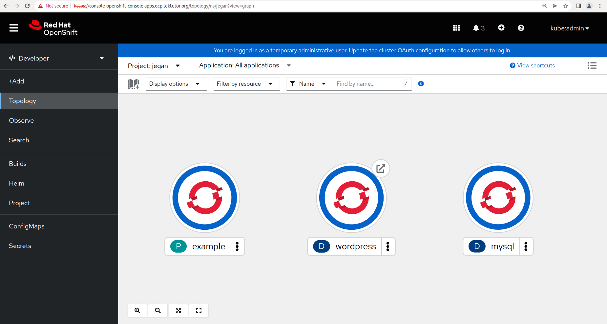
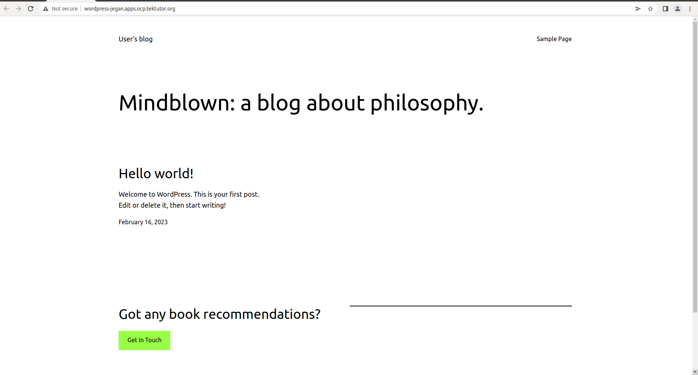

# Day4

## Lab - Deploying mysql db server into OpenShift that uses a Persistent Storage from NFS

First you need to edit the yml files and replace 'jegan' with your name and the IP address with your centos IP.

```
cd ~/openshift-feb-2023
git pull

cd Day4/mysql-with-persistent-storage

oc project

oc create -f mysql-pv.yml
oc create -f mysql-pvc.yml
oc create -f mysql-deploy.yml
```

If everything went well, you should see the mysql pod running under your project namespace from your OpenShift webconsole. Once you see the mysql Pod is running state, click on the Pod Terminal in the OpenShift web console.

Try these commands under the mysql pod terminal from Web console. Type 'root@123' as password when it prompts.
```
mysql -u root -p
SHOW DATABASES
CREATE DATABASE tektutor;
USE tektutor;
CREATE TABLE training ( id INT NOT NULL, name VARCHAR(50), duration VARCHAR(50), PRIMARY KEY(id) );
INSERT INTO training VALUES ( 1, "DevOps", "5 Days" );
INSERT INTO training VALUES ( 2, "Advanced Kubernetes", "5 Days" );
INSERT INTO training VALUES ( 3, "Tekton CICD with OpenShift ", "5 Days" );
SELECT * FROM training;
exit
exit
```

Now try deleting the mysql pod from your web console and observe a new mysql pod getting created and moves to running state.  Once it moves to running states, get inside the Pod terminal and verify if the tektutor database and training tables has retained the records inserted in the previous Pod.

The take away message is Persistent Volume helps retain the data even if the Pods are replaced with new ones. This way we will not loose the application data.

## Lab - Deploying wordpress and mariadb server

Make sure, you delete the mysql deployment and the corresponding persistent volume and claims.  Also ensure the /var/userxy folder contents are deleted.

```
cd ~/openshift-feb-2023
git pull

cd Day4/wordpress

oc create -f mysql-pv.yml
oc create -f mysql-pvc.yml
oc create -f mysql-deploy.yml
oc create -f mysql-svc.yml

oc create -f wordpress-deploy.yml
oc create -f wordpress-svc.yml
oc create -f wordpress-route.yml
```

If everything went well, you should be able to see the topology status as below


Now you may click on the Wordpress route from Developer ==> Topology and see the Wordpress page as shown below.


For details on the maridab environment variables, you may refer here
<pre>
https://hub.docker.com/r/bitnami/mariadb
</pre>

For details on the Wordpress environment variables, you may refer here
<pre>
https://hub.docker.com/r/bitnami/wordpress
</pre>

